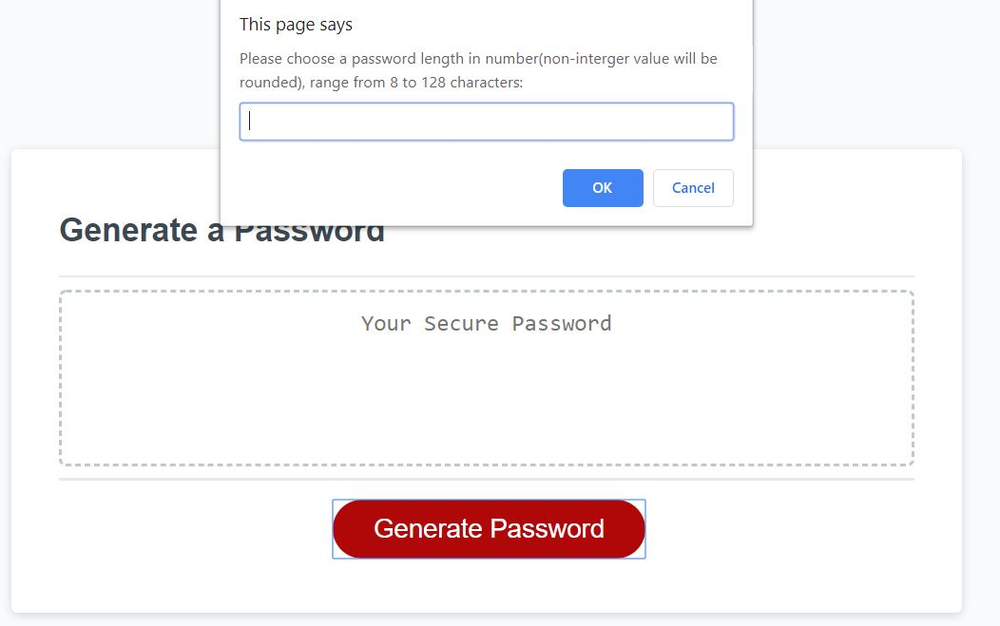
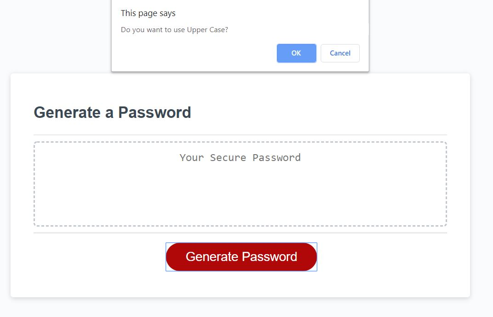
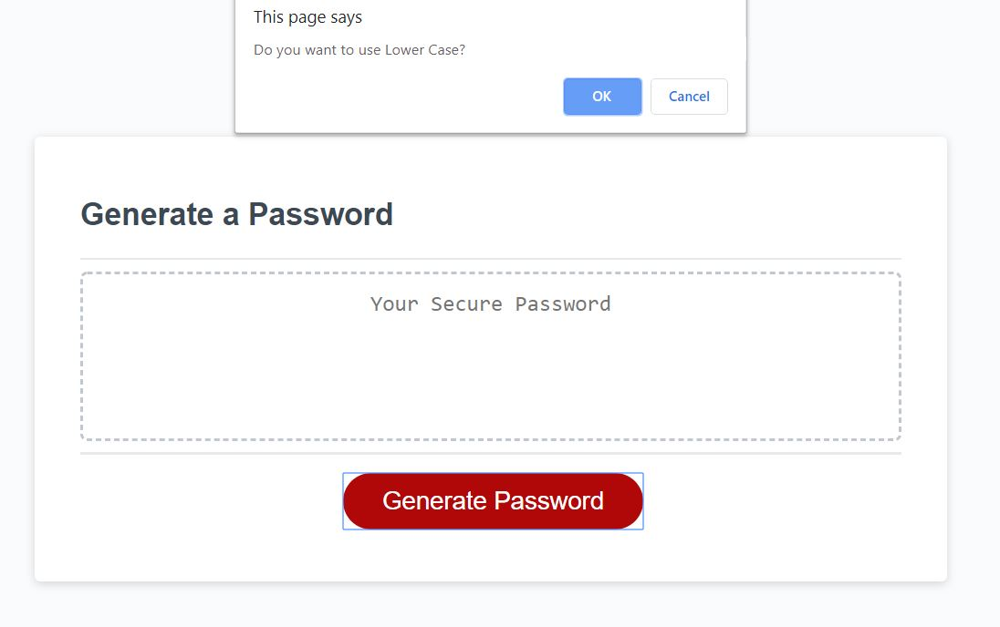
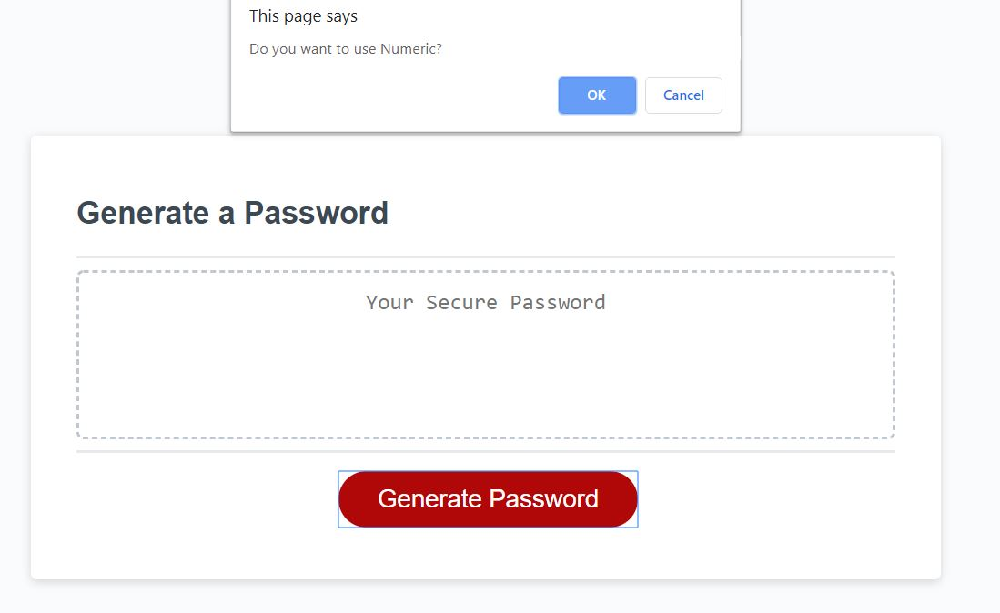
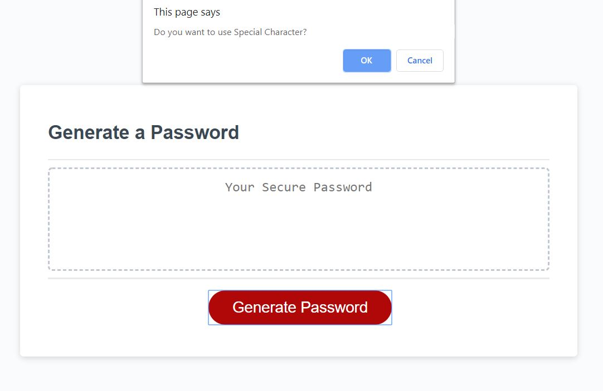
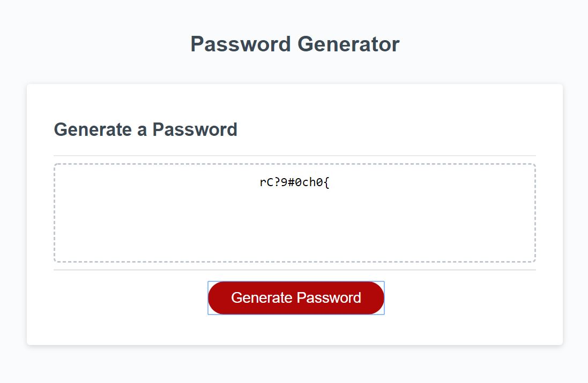

## Assignment3: Password Generator

An application that generates a random password based on user-selected criteria. This app will run in the browser and feature dynamically updated HTML and CSS powered by your JavaScript code. It will also feature a clean and polished user interface and be responsive, ensuring that it adapts to multiple screen sizes.


## How to use the Application
```
After click on the Generated Password button, user will be prompted for a series of questions:
```
```
1- Length of the password
```

```
2- If use upper case letter
```

```
3- If use lower case letter
```

```
4- If use numeric vale
```

```
5- If use special character
```


```
- If the password length is smaller than 8 or bigger than 128, user will be alert with error message. 
- At least one criteria needs to be given to generate the password, else user will be alert with error message. 
- Password will be generated that matches all the selected criteria 

Below is a sample password based on input requirements
```

